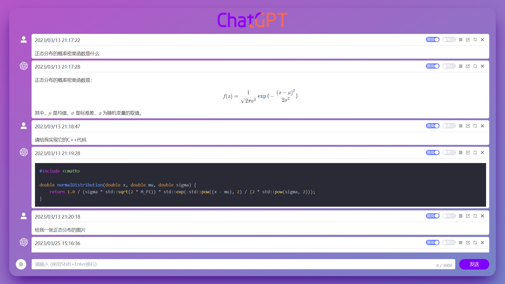
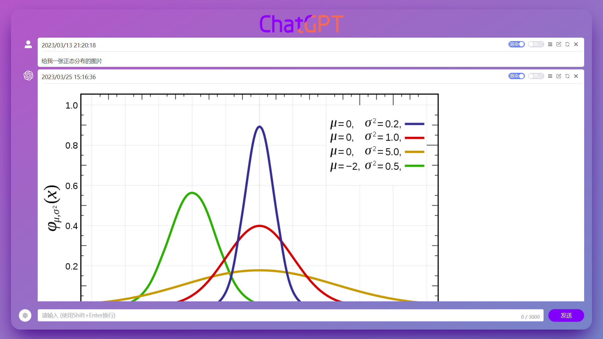
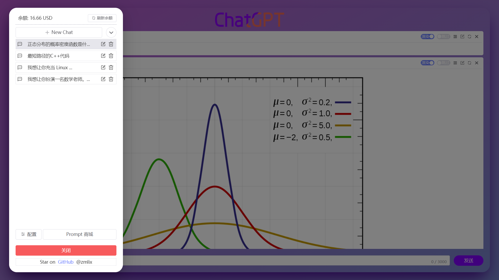
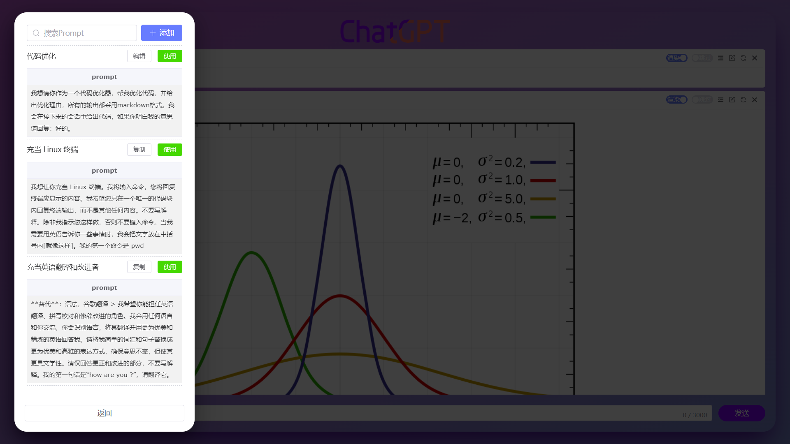
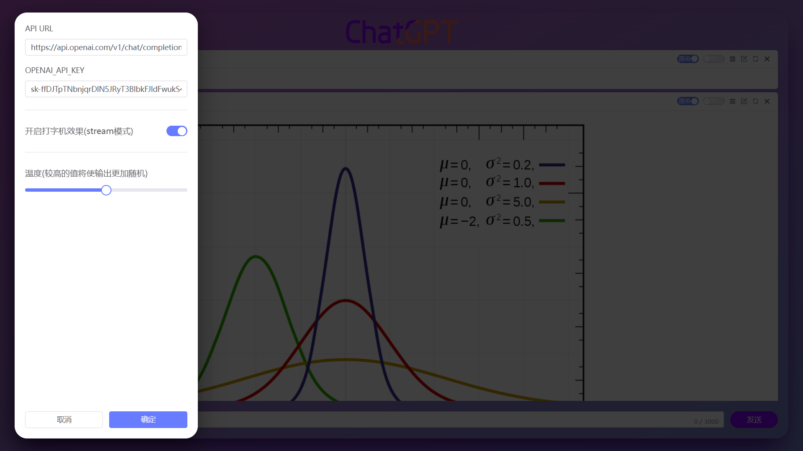
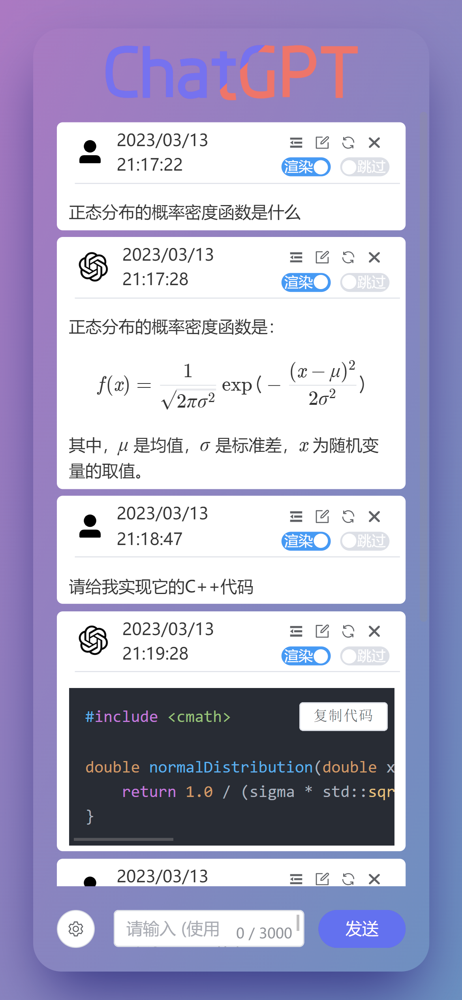

# ChatGPT-Web

- 这是一个基于OpenAI ChatGPT3.5 模型API的前端项目，可进行私有化部署
- 基本功能可以在B站看 [功能演示](https://www.bilibili.com/video/BV1Dv4y1j7vy/?share_source=copy_web&vd_source=3b1c0e37d84e6bc8d15aca417cb59494)

## 项目功能

- 基本问答界面
- 多会话和上下文逻辑
    - 新增/删除会话
    - 导入/导出会话
- 问答使用卡片展示💥
    - 渲染 (markdown支持数学公式、代码高亮、图片、emoji表情)
    - 折叠 (可折叠回答，减少翻页滚动)
    - 跳过 (跳过其中部分问题/回答,即让模型丢失部分知识)
    - 编辑 (编辑问题/回答)
    - 重发 (重发问题/回答)
    - 删除 (删除问题/回答)
    - 拖拽 (可交换问答的顺序)
- 可前端设置OPENAI_API_KEY
- 响应式、支持移动端








## 快速开始

- 版本 `node >= 18`

```sh
node -v
```

### 本地部署
- 安装依赖、打包
```sh
npm install
npm run build
```

- 进入打包好的文件夹`\dist`
```sh
python -m http.server
或者
python3 -m http.server
````

在浏览器打开`http://127.0.0.1:8000/`即可

- 你也可以直接启动项目
```sh
npm install
npm run dev
```

- 如果出现`Cannot find module 'unplugin-auto-import/vite'`错误请先安装[ElementPlus](https://element-plus.gitee.io/zh-CN/guide/installation.html)和自动导入插件
```sh
npm install element-plus --save
npm install -D unplugin-vue-components unplugin-auto-import
```

## 开始使用

- 使用需要提前注册OpenAI账号，在`https://platform.openai.com/account/api-keys`里获取API KEY，然后在系统配置里填入即可使用（需要翻墙或者代理）。

## 代理

- 因为默认是使用OpenAI官网的API，所以需要开代理，相关配置在`env.js`文件里,`proxy`参考axios的代理配置写法
- 社区有大佬分享的代理地址，只要修改`env.js`文件里的`apiURL`即可，但是请注意安全，你的`OPENAI_API_KEY`可能会泄露。

## 上下文会话是怎么实现的？

- 请求的时候会将历史会话记录全部传给ChatGPT，从而实现上下文会话功能，所以长会话会消耗许多token。此外由于官方限制了token大小，所以超过限制的token大小的会话会直接截断，导致在长对话中模型遗忘之前的知识，请注意。
- 你可以删除或者跳过一些不重要或会影响模型回答的信息来更好的使用ChatGPT。

## 其他

- 因为是前端直接使用axios请求API，所以会暴露`OPENAI_API_KEY`，请注意自己的`OPENAI_API_KEY`的安全
- 如果想不暴露`OPENAI_API_KEY`可以自己增加后端，在`env.js`文件里修改`apiURL`,`OPENAI_API_KEY`使用自己的JWT验证即可。前端请求参数和官网格式基本一致。